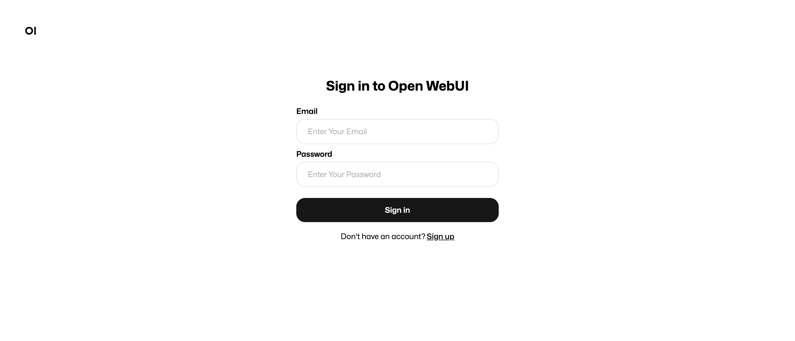

# MCP Inspector Teaching App

<div align="center">



**An educational tool that visualizes Model Context Protocol (MCP) communication in real-time**

[Features](#features) • [Quick Start](#quick-start) • [Usage](#usage) • [Architecture](#architecture) • [Documentation](#documentation)

</div>

---

## Overview

The **MCP Inspector Teaching App** is a Next.js-based educational tool designed to demystify the Model Context Protocol (MCP) by providing transparent, real-time visualization of the complete communication flow between an LLM-powered chat interface and MCP servers.

### What is MCP?

The [Model Context Protocol (MCP)](https://modelcontextprotocol.io) is an open protocol that enables AI applications to securely connect to data sources and tools. Think of it as a universal adapter that lets AI assistants access databases, APIs, file systems, and more—without custom integrations for each source.

### Why This App?

Understanding MCP can be challenging because the protocol involves multiple actors (Host App, LLM, MCP Server) communicating through complex message sequences. This app makes learning MCP intuitive by:

- **Visualizing the 5-phase workflow** from initialization through final response
- **Showing that the LLM never directly calls MCP servers** (the Host App orchestrates everything)
- **Recording every protocol message and internal operation** for complete transparency
- **Maintaining strict vertical alignment** so you can trace causality across actors

## Features

### 🎯 Core Capabilities

- **Actor-Based Timeline Visualization** - Five-column layout showing Host App, LLM, and MCP Server as separate actors
- **Complete Protocol Coverage** - All 5 phases of MCP workflow (initialization, discovery, selection, execution, synthesis)
- **Real-Time Event Streaming** - Server-Sent Events (SSE) for live timeline updates
- **Interactive Message Cards** - Click to expand/collapse JSON-RPC messages with syntax highlighting
- **Persistent MCP Connections** - Global singleton client for stateful server connections
- **Two-Phase LLM Inference** - Clearly shows planning (tool selection) separate from synthesis (final response)

### 🔍 Educational Features

- **Pre-configured AWS Documentation MCP Server** - No API keys required, works immediately
- **Suggested Queries** - Three example queries demonstrating different interaction patterns
- **Vertical Alignment System** - Events at the same height are causally related
- **Console Logs** - See internal operations from all actors (Host, LLM, MCP Server)
- **Performance Metrics** - Track processing times for each phase

### 🛠️ Technical Features

- Built with **Next.js 15** (App Router) and **React 19**
- **TypeScript** throughout with strict type safety
- **Tailwind CSS** for responsive design
- **Zustand** for state management
- **Tested** with Jest + React Testing Library (49 passing tests)
- **Optimized** for 100+ timeline events with React.memo

## Quick Start

### Prerequisites

Before you begin, ensure you have:

- **Node.js 20+** (LTS recommended)
- **npm or pnpm** (package manager)
- **Python 3.10+** (for MCP servers)
- **uv** (Python package manager) - [Install uv](https://docs.astral.sh/uv/)
- **Anthropic API Key** - Get one at [console.anthropic.com](https://console.anthropic.com)

### Installation

1. **Clone the repository**

```bash
git clone <repository-url>
cd mcp-visualizer
```

2. **Navigate to the application directory**

```bash
cd mcp-inspector-app
```

**Important:** All subsequent commands should be run from the `mcp-inspector-app` directory!

3. **Install dependencies**

```bash
npm install
```

4. **Set up environment variables**

Create a `.env.local` file in the current directory (`mcp-inspector-app`):

```bash
# Copy the example file
cp .env.local.example .env.local

# Edit .env.local and add your API key
ANTHROPIC_API_KEY=sk-ant-...your-key-here...
```

5. **Verify AWS Documentation MCP Server**

The app uses the AWS Documentation MCP Server, which requires `uvx` (part of the `uv` package manager):

```bash
# Test that uvx is installed
uvx --version

# Verify the MCP server package can be installed (this will download it)
uvx awslabs.aws-documentation-mcp-server@latest
```

**Note:** The server command will appear to hang - this is normal! It's waiting for JSON-RPC input via stdin. Press `Ctrl+C` to exit. As long as you see "Installed X packages" without errors, you're ready to go!

### Running the Application

```bash
# Start the development server
npm run dev
```

The app will be available at `http://localhost:3000` (or the next available port if 3000 is in use).

## Usage

### First-Time User Experience

When you first open the app, you'll see:

1. **Timeline View** - Five columns representing the actor-based architecture
2. **Suggested Queries** - Three pre-configured examples to get started
3. **Connection Status** - Shows when the MCP server is connected and ready

### Running Your First Query

**Try the suggested query:** "Search AWS documentation for S3 bucket naming rules"

1. Click the **"Try this query"** button or enter the query manually
2. Press **Send** or hit Enter
3. Watch the timeline populate in real-time:
   - **Phase 1:** Initialization & Negotiation (if not already connected)
   - **Phase 2:** Tool Discovery (listing available MCP tools)
   - **Phase 3:** Model-Driven Selection (LLM plans which tools to use)
   - **Phase 4:** Execution Round Trip (MCP server calls AWS API)
   - **Phase 5:** Synthesis & Final Response (LLM generates natural language answer)

### Understanding the Timeline

#### Column Layout

The five-column layout is crucial to understanding MCP:

| Column | Width | Purpose |
|--------|-------|---------|
| **Host App** | 20% | Chat interface, orchestration logic, console logs |
| **Host ↔ LLM** | 15% | Communication lane showing LLM API requests/responses |
| **LLM** | 15% | LLM inference processing and internal operations |
| **Host ↔ MCP** | 15% | Communication lane showing JSON-RPC messages |
| **MCP Server** | 35% | Server operations, tool execution, external API calls |

**Key Insight:** Notice there's NO direct connection between the LLM and MCP Server columns. The Host App orchestrates all communication!

#### Message Card Types

Message cards in the communication lanes use color-coded borders:

- **🟢 Green left border** - REQUEST (expects a response)
- **🔵 Blue right border** - RESPONSE (reply to a request)
- **🟣 Purple left border** - NOTIFICATION (no response expected)
- **🔴 Red border** - ERROR

Click any message card to expand and view the full JSON payload with syntax highlighting.

#### Console Log Badges

Console logs show internal operations with color-coded badges:

- **USER INPUT** (gray) - User submitted a message
- **SYSTEM** (blue) - System events (connections, handshakes)
- **INTERNAL** (gray) - Internal processing (schema conversions, etc.)
- **LLM** (indigo) - LLM inference operations
- **SERVER** (green) - MCP server operations
- **LOG** (yellow) - General informational logs
- **COMPLETE** (gray) - Workflow completion markers

### Suggested Queries

The app includes three pedagogical queries:

#### 1. Single Tool Example
**Query:** "Search AWS documentation for S3 bucket naming rules"

Demonstrates the simplest workflow with one tool call. Perfect for first-time users.

#### 2. Multiple Tools Example
**Query:** "Look up S3 bucket naming rules and show me related topics"

Shows the LLM selecting multiple tools and executing them sequentially within Phase 4.

#### 3. Model-Driven Selection
**Query:** "What are the security best practices for Lambda functions?"

Demonstrates the LLM autonomously choosing the right tool based on query intent.

### Interactive Features

- **Expand/Collapse Messages** - Click any message card to toggle JSON payload visibility
- **Scroll Timeline** - Timeline scrolls vertically; all columns maintain alignment
- **Phase Headers** - Sticky headers show which phase you're in
- **Status Bar** - Bottom bar shows connection status and event count

## Architecture

### Actor-Based Design

The app uses an **actor-based architecture** inspired by sequence diagrams:

```
┌──────────────┬──────────────┬──────────────┬──────────────┬──────────────┐
│ Host App     │ Host ↔ LLM   │ LLM          │ Host ↔ MCP   │ MCP Server   │
│ (20%)        │ (15%)        │ (15%)        │ (15%)        │ (35%)        │
├──────────────┼──────────────┼──────────────┼──────────────┼──────────────┤
│ Chat UI      │ LLM Request  │ Processing   │ initialize   │ Handshake    │
│ Console Logs │ Cards        │ Indicators   │ tools/list   │ Tool Exec    │
│ User Input   │              │              │ tools/call   │ External API │
└──────────────┴──────────────┴──────────────┴──────────────┴──────────────┘
    ▲                                                              ▲
    │                                                              │
    └──────────  Host orchestrates all communication   ────────────┘

(LLM never talks directly to MCP)
```

### Five-Phase MCP Workflow

Every query follows this protocol-compliant workflow:

1. **Initialization & Negotiation** - Three-message handshake (`initialize` → response → `initialized`)
2. **Discovery & Contextualization** - `tools/list` request to discover available tools
3. **Model-Driven Selection** - First LLM inference (planning) returns `tool_use` blocks
4. **Execution Round Trip** - `tools/call` request(s) to MCP server, which delegates to external APIs
5. **Synthesis & Final Response** - Second LLM inference (synthesis) generates natural language answer

**Critical Teaching Point:** The LLM makes TWO calls—one for planning, one for synthesis. This is often misunderstood!

### Technology Stack

- **Frontend:** Next.js 15 (App Router), React 19, TypeScript 5
- **Styling:** Tailwind CSS 4
- **State Management:** Zustand 5
- **MCP Integration:** [@modelcontextprotocol/sdk](https://github.com/modelcontextprotocol/typescript-sdk) v1.20
- **LLM Integration:** [@anthropic-ai/sdk](https://github.com/anthropics/anthropic-sdk-typescript) v0.65
- **Real-Time Events:** Server-Sent Events (SSE)
- **Testing:** Jest 30 + React Testing Library 16

### Vertical Alignment System

**Most Important UI Requirement:** All columns maintain strict vertical alignment using **spacer blocks**.

When one actor has activity (e.g., MCP Server logging multiple messages), other columns render empty spacer blocks to maintain alignment. This allows users to trace causality horizontally across the timeline.

See [docs/Module 5 Validation Results.md](docs/Module%205%20Validation%20Results.md) for visual examples.

## Documentation

### Primary Documents

- **[MVP Product Requirements Document](docs/MCP%20Inspector%20Teaching%20App%20-%20MVP%20Product%20Requirements%20Document.md)** - Complete product specification
- **[Technical Design Document](docs/Technical%20Design%20Document%20-%20MVP.md)** - Architecture and implementation details
- **[MCP Sequence Diagram](docs/MCP%20Sequence%20diagram.md)** - Protocol-compliant sequence diagram
- **[Event Recording System Diagram](docs/Event%20Recording%20System%20Diagram.md)** - Event architecture and playback support

### Module Validation Reports

The app was built progressively over 11 modules with comprehensive validation at each stage:

- [Module 1: Layout & Grid System](docs/Module%201%20Validation%20Results.md)
- [Module 2: Event Recording System](docs/Module%202%20Validation%20Results.md)
- [Module 3: Actor Components](docs/Module%203%20Validation%20Results.md)
- [Module 4: Communication Lane Components](docs/Module%204%20Validation%20Results.md)
- [Module 5: Layout Engine](docs/Module%205%20Validation%20Results.md)
- [Module 6: MCP Integration](docs/Module%206%20Validation%20Results.md)
- [Module 6B: SSE & Stateful Connections](docs/Module%206B%20Validation%20Results.md) *(Architecture doc: [Module 6B Architecture](docs/Module%206B%20Architecture%20-%20SSE%20and%20Stateful%20Connections.md))*
- [Module 7: LLM Integration](docs/Module%207%20Validation%20Results.md)
- [Module 8: Orchestration Engine](docs/Module%208%20Validation%20Results.md)
- [Module 9: Interactive Features & Polish](docs/Module%209%20Validation%20Results.md)
- [Module 10: Performance & Testing](docs/Module%2010%20-%20Testing%20and%20Performance%20Validation.md)
- [Module 11: Actor-Based Timeline](docs/Module%2011%20-%20Actor-Based%20Timeline%20Implementation.md)

### Visual Design

- **[Mockups](docs/Mockups.md)** - Initial design mockups
- **[Interactive HTML Mockup](docs/mcp-inspector-actor-based.html)** - Static HTML prototype

## Development

### Project Structure

```
mcp-visualizer/
├── mcp-inspector-app/          # Next.js application
│   ├── app/                    # Next.js App Router pages
│   │   ├── api/                # API routes (workflow, events, LLM, MCP)
│   │   ├── demo/               # Demo page (removed - see timeline)
│   │   └── timeline/           # Main timeline page
│   ├── components/             # React components
│   │   ├── actors/             # Actor column components
│   │   ├── grid/               # Grid layout components
│   │   ├── lanes/              # Communication lane components
│   │   └── timeline/           # Timeline view components
│   ├── lib/                    # Core libraries
│   │   ├── mcp/                # MCP client integration
│   │   ├── llm/                # Claude API integration
│   │   ├── orchestration/      # 5-phase workflow orchestration
│   │   ├── event-builder.ts    # Event creation helpers
│   │   ├── layout-engine.ts    # Row building & spacer insertion
│   │   └── constants.ts        # Colors, badge types, etc.
│   ├── store/                  # Zustand state management
│   ├── types/                  # TypeScript type definitions
│   └── __tests__/              # Jest unit tests
├── mcp_visualizer/             # Python POC (reference implementation)
│   └── poc/                    # Validated Python proof-of-concept
└── docs/                       # Documentation and validation reports
```

### Running Tests

**Note:** Run these commands from the `mcp-inspector-app` directory.

```bash
# Run all tests
npm test

# Watch mode
npm run test:watch

# Coverage report
npm run test:coverage
```

**Current Status:** 49 tests passing (26 event-builder + 23 layout-engine)

### Building for Production

**Note:** Run these commands from the `mcp-inspector-app` directory.

```bash
# Build optimized production bundle
npm run build

# Start production server
npm start
```

### Environment Variables

Create `.env.local` in the `mcp-inspector-app` directory:

```bash
# Required: Anthropic API key for Claude
ANTHROPIC_API_KEY=sk-ant-...your-key-here...

# Optional: Override default MCP server command
# MCP_SERVER_COMMAND=uvx
# MCP_SERVER_ARGS=awslabs.aws-documentation-mcp-server@latest
```


## Troubleshooting

### MCP Server Won't Connect

If the AWS Documentation MCP Server fails to connect:

1. **Verify uvx is installed:**
   ```bash
   uvx --version
   ```
   If not found, install uv: [https://docs.astral.sh/uv/](https://docs.astral.sh/uv/)

2. **Test the server package installation:**
   ```bash
   # This will download and cache the package
   uvx awslabs.aws-documentation-mcp-server@latest
   # Press Ctrl+C to exit (it's normal for it to wait for input)
   ```

3. **Check console logs** in the browser DevTools for specific error messages

4. **Look for MCP server logs** in the terminal where you ran `npm run dev` - you should see messages like:
   ```
   [MCPGlobalClient] Connecting to: uvx awslabs.aws-documentation-mcp-server@latest
   [MCPGlobalClient] Connection established
   ```

### LLM API Errors

If you see "API key not found" or authentication errors:

1. **Verify your `.env.local` file exists** in `mcp-inspector-app/`
2. **Check the API key format** (starts with `sk-ant-`)
3. **Restart the dev server** after updating `.env.local`

### Timeline Not Updating

If the timeline doesn't populate with events:

1. **Check the browser console** for JavaScript errors
2. **Verify the SSE connection** is established (check Network tab in DevTools)
3. **Try refreshing the page** to restart the event stream

### Performance Issues

If the timeline feels slow with many events:

- The app is optimized for 100+ events. If you're seeing 500+, performance may degrade.
- Clear the timeline and start a fresh session
- Check Module 10 validation results for performance benchmarks

## Contributing

This is an educational project created to teach the Model Context Protocol. Contributions are welcome!

### Development Workflow

1. Fork the repository
2. Create a feature branch
3. Make your changes
4. Add tests if applicable
5. Run `npm test` and `npm run build` to verify
6. Submit a pull request

### Code Style

- TypeScript strict mode enabled
- Tailwind CSS for styling
- Follow existing component patterns
- Document complex logic with comments

## Learn More

### MCP Resources

- **Model Context Protocol Specification:** [https://modelcontextprotocol.io/specification](https://modelcontextprotocol.io/specification)
- **MCP Documentation:** [https://modelcontextprotocol.io/docs](https://modelcontextprotocol.io/docs)
- **MCP TypeScript SDK:** [https://github.com/modelcontextprotocol/typescript-sdk](https://github.com/modelcontextprotocol/typescript-sdk)
- **AWS Documentation MCP Server:** [https://awslabs.github.io/mcp/servers/aws-documentation-mcp-server](https://awslabs.github.io/mcp/servers/aws-documentation-mcp-server)

### Claude API Resources

- **Anthropic Documentation:** [https://docs.anthropic.com](https://docs.anthropic.com)
- **Tool Use Guide:** [https://docs.anthropic.com/en/docs/tool-use](https://docs.anthropic.com/en/docs/tool-use)
- **TypeScript SDK:** [https://github.com/anthropics/anthropic-sdk-typescript](https://github.com/anthropics/anthropic-sdk-typescript)

### Next.js Resources

- **Next.js Documentation:** [https://nextjs.org/docs](https://nextjs.org/docs)
- **App Router Guide:** [https://nextjs.org/docs/app](https://nextjs.org/docs/app)

## License

[Add your license information here]

## Acknowledgments

- **Model Context Protocol Team** - For creating an excellent open protocol
- **AWS Labs** - For the AWS Documentation MCP Server
- **Anthropic** - For Claude and the tool use capabilities
- **Next.js Team** - For the powerful React framework

---

<div align="center">

**Built with ❤️ to teach the Model Context Protocol**

[Report Bug](../../issues) • [Request Feature](../../issues)

</div>
