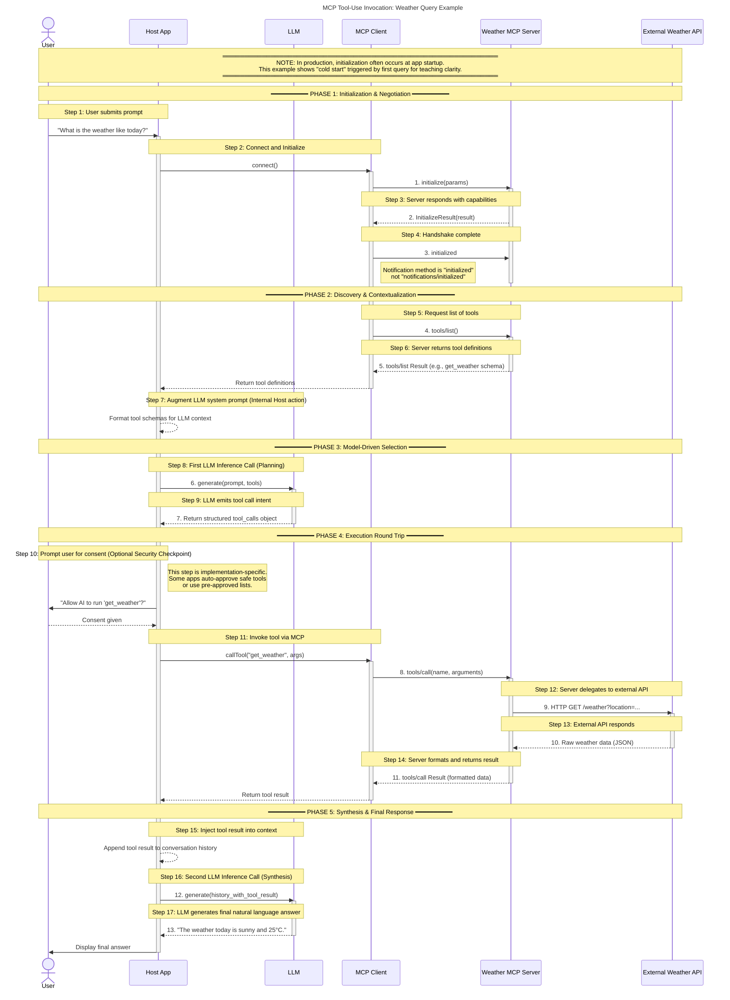

---
llm-planning:
---

### **Protocol Alignment Overview**

This sequence diagram accurately represents a complete MCP tool invocation flow as specified in the Model Context Protocol (2025-06-18 revision). The diagram demonstrates all required phases and message exchanges for a typical tool-calling scenario.

---

### **Phase-by-Phase Protocol Compliance**

#### **Phase 1: Initialization & Negotiation**

The diagram correctly implements the mandatory three-message initialization handshake: (1) client sends `initialize` request with protocol version and capabilities, (2) server responds with `InitializeResult` containing its capabilities, and (3) client sends `initialized` notification to signal readiness.

**Timing Note:** The protocol states that "the client SHOULD NOT send requests other than pings before the server has responded to the initialize request" and "the server SHOULD NOT send requests other than pings and logging before receiving the initialized notification". The diagram shows initialization triggered by the first user query (a "cold start" scenario), though production implementations often initialize at application startup.

#### **Phase 2: Discovery & Contextualization**

The diagram correctly shows the `tools/list` request-response pattern used to discover available tools. This phase demonstrates how the Host App retrieves tool schemas and augments the LLM's context with available capabilities before tool selection.

Servers must declare the `tools` capability during initialization, which enables the client to perform tool discovery.

#### **Phase 3: Model-Driven Selection**

The diagram accurately represents MCP's design principle that tools are "model-controlled," meaning the language model discovers and invokes tools automatically based on contextual understanding. The LLM receives the tool schemas and makes an autonomous decision to invoke `get_weather`.

#### **Phase 4: Execution Round Trip**

The diagram shows the complete tool invocation cycle:

1. **User Consent (Optional):** The protocol strongly recommends human-in-the-loop approval, stating "there SHOULD always be a human in the loop with the ability to deny tool invocations" and "applications SHOULD present confirmation prompts to the user". The diagram correctly marks this as "Optional Security Checkpoint" since it's implementation-specific.
2. **Tool Call:** The `tools/call` request includes the tool name and arguments in the standard format.
3. **External Delegation:** The diagram shows the Weather MCP Server delegating to an External Weather API, demonstrating the common pattern where MCP servers act as adapters to external services.
4. **Result Return:** Tool results are returned with structured content in the standard format, containing content blocks (text, images, etc.) and an `isError` flag.

#### **Phase 5: Synthesis & Final Response**

The diagram shows the Host App injecting the tool result back into the conversation context and making a second LLM inference call to synthesize the final natural language response. This accurately reflects the typical agentic loop pattern in MCP implementations.

---

### **Message Numbering**

The diagram uses dual numbering:

- **Protocol Messages (1-13):** JSON-RPC messages exchanged over the wire
- **Steps (1-17):** All operations including internal LLM processing

This distinction helps learners understand that not all steps generate protocol messages—some are internal to the Host App or LLM.

---

### **Architectural Accuracy**

The diagram correctly separates:

- **Host App:** Orchestrator managing the conversation flow
- **LLM:** Inference service making tool selection decisions
- **MCP Client:** Protocol implementation handling message serialization
- **Weather MCP Server:** Protocol server exposing tools
- **External Weather API:** Backend service providing actual data

This separation aligns with MCP's architecture where "servers expose tools that can be invoked by language models" through a standardized protocol layer.

---

### **Security Considerations**

The diagram appropriately highlights user consent as a security checkpoint, reflecting the protocol's guidance that "clients SHOULD show tool inputs to the user before calling the server, to avoid malicious or accidental data exfiltration".

---

### **Conclusion**

This sequence diagram is **pedagogically sound and protocol-compliant**. It accurately represents a complete MCP tool invocation workflow from user input through initialization, discovery, model-driven selection, execution, and synthesis. The visual representation makes the abstract protocol concrete and accessible for learners while maintaining technical accuracy against the specification.
## Diagram

